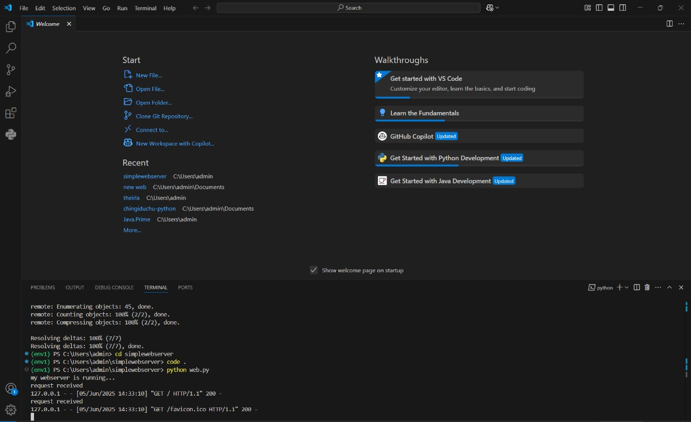
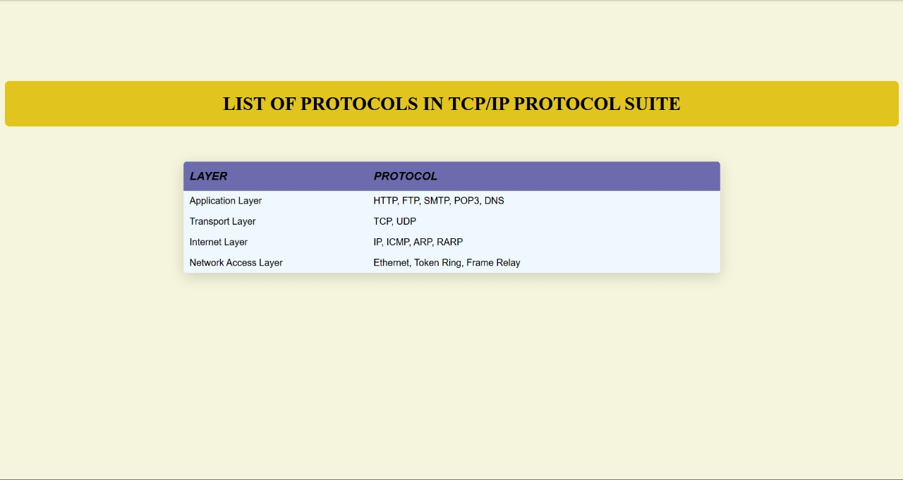

# EX01 Developing a Simple Webserver
## Date:05.03.2025

## AIM:
To develop a simple webserver to serve html pages and display the list of protocols in TCP/IP Protocol Suite.

## DESIGN STEPS:
### Step 1: 
HTML content creation.

### Step 2:
Design of webserver workflow.

### Step 3:
Implementation using Python code.

### Step 4:
Import the necessary modules.

### Step 5:
Define a custom request handler.

### Step 6:
Start an HTTP server on a specific port.

### Step 7:
Run the Python script to serve web pages.

### Step 8:
Serve the HTML pages.

### Step 9:
Start the server script and check for errors.

### Step 10:
Open a browser and navigate to http://127.0.0.1:8000 (or the assigned port).

## PROGRAM:
```
from http.server import HTTPServer, BaseHTTPRequestHandler
content = """
<html>
    <head>
        
        <title>Computer Attributes</title>
        <style>
            body{
    background: #F5F5DC;
}
table{
    
    margin:20px auto;
    width: 60%;
    box-shadow: 0 6px 22px rgba(0, 0, 0, 0.15);
    border-color: black;
    border-collapse: collapse;
    border-radius:5px;
    overflow: hidden;
    
    
    
}
th{
    text-transform: uppercase;
    background-color: rgb(108, 108, 173);
    padding-left: 10px;
    text-align: start;
    font-family:Helvetica;
    font-style: italic;
    font-size: larger;
}
td{
 height: 35px;
 background-color: aliceblue;
 padding-left: 10px;
 font-family: Arial, Helvetica, sans-serif;
}
tr:hover td {
    background-color: aquamarine;
    position: static;
}
h1{
    font-style: unset;
    backdrop-filter: initial;
    background-color:#e1c41d;
    display:inline-flexbox;
    border-radius: 8px;
    padding: 20px 100px; 
    text-transform: uppercase;
}
        </style>
    </head>
    <body>
        <br>
        <br>
        <br>
        <br>
        <br>
        <br>
        <center>
            <h1>list of protocols in TCP/IP Protocol Suite</h1>
            <br>
        </center>
    <table align="center" width="600" border="0">
    <tr>
            <th width="40" heigth="50">layer</th>
            <th width="160" height="50"border-left>protocol</th>
    </tr>
    <tr>
        <td> Application Layer	</td>
        <td>HTTP, FTP, SMTP, POP3, DNS</td>
    </tr>
    <tr>
        <td>Transport Layer	</td>
        <td>TCP, UDP</td>
    </tr>
    <tr>
        <td>Internet Layer	</td>
        <td>IP, ICMP, ARP, RARP</td>
    </tr>
    <tr>
        <td>Network Access Layer</td>
        <td>Ethernet, Token Ring, Frame Relay</td>
</tr>
    </table>
    </body>
    
</html>
"""
class myhandler(BaseHTTPRequestHandler):
    def do_GET(self):
        print("request received")
        self.send_response(200)
        self.send_header('content-type', 'text/html; charset=utf-8')
        self.end_headers()
        self.wfile.write(content.encode())
server_address = ('',8000)
httpd = HTTPServer(server_address,myhandler)
print("my webserver is running...")
httpd.serve_forever()
```

## OUTPUT:


## RESULT:
The program for implementing simple webserver is executed successfully.
